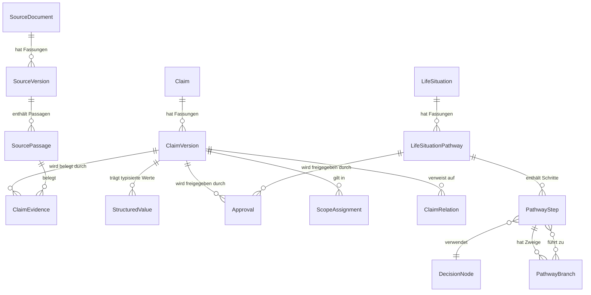

# CareApp – Architektur: Wissensmodell & deterministischer Kontrollkern

**Status:** Accepted (Layer 1 + Layer 2)
**Gültig für:** Chatbot-Teil mit agentischem Datenbankwissen
**Letzte Aktualisierung:** 2026-06-13 (Pathway-Datenmodell ergänzt)
**Verbindlichkeit:** Dieses Dokument ist eine Architekturübergabe. Es behauptet
nicht, dass die beschriebenen Komponenten implementiert sind. Nachfolgende
Agenten dürfen die hier festgelegten Schichtgrenzen und Invarianten **nicht**
unterlaufen.

---

## 0. Geltungsbereich dieses Dokuments

Dieses Dokument spezifiziert die zwei untersten, am teuersten zu ändernden
Schichten des CareApp-Chatbots:

- **Layer 1 — Wissens- & Provenienz-Datenmodell** (was gespeichert wird und wie
  Versionierung, Belege und Gültigkeit strukturiert sind).
- **Layer 2 — Deterministischer Kontrollkern** (Eligibility-Filter, Evidence
  Builder, Coverage-Bewertung, Post-Generation-Validator — reiner
  Anwendungscode, **kein LLM**).

**Nicht** Teil dieses Dokuments (folgt in Layer 3+):
- LLM-Schichten (Scope/Safety-Klassifikation, Anliegen-Verständnis, Grounded
  Response Composer, optionaler LLM-Bedeutungscheck),
- Conversation-Orchestrierung (LangGraph),
- Adversarial-/Prompt-Injection-Threat-Model,
- redaktioneller Workflow (Import, Review, Freigabe) im Detail,
- Oberflächen.

Maßgeblich bleiben zusätzlich die Produktbeschreibung und der bestehende
technische Bauplan des Chatbots, deren zentrale Architekturregel hier nur
verdichtet wiederholt wird.

---

## 1. Zentrale Architekturregel (Wiederholung, verbindlich)

CareApp ist **kein** Chatbot, der Fachfragen aus dem antrainierten Wissen eines
Sprachmodells beantwortet.

| Komponente | Verantwortung | Verbot |
|---|---|---|
| LLM | Sprache verstehen, Anliegen strukturieren, Rückfragen und **belegte** Inhalte verständlich formulieren | Fachwissen ergänzen, Ansprüche ableiten, medizinisch beraten, Wissen freigeben |
| Knowledge Store | Versionierte Quellen, Passagen und veröffentlichte ClaimVersionen speichern | Aus freiem Text neue fachliche Wahrheit erzeugen |
| Deterministischer Code | Gültigkeit, Region, Mandant, Status, Provenienz, Antwortfähigkeit prüfen | Unsicherheit durch Wahrscheinlichkeitsannahmen ersetzen |
| Fachredaktion | ClaimVersionen prüfen, freigeben, veröffentlichen, zurückziehen | Verantwortung an ein Modell delegieren |
| Validator | Jede atomare Aussage vor Auslieferung prüfen | Eine unbelegte Aussage wegen sprachlicher Plausibilität freigeben |

> **Sicherheitsziel:** Unbelegte, ungültige oder unzulässige fachliche
> Modellinhalte dürfen die Nutzeroberfläche nicht erreichen.

Verbindlicher Fallback im Wortlaut:

> „Dazu liegen mir keine geprüften Informationen vor.“

---

## 2. Entscheidungslog

| # | Entscheidung | Begründung | Status |
|---|---|---|---|
| D1 | Planung beginnt mit dem **Datenmodell** (Layer 1), nicht mit dem Kontrollkern. | Der gesamte Kontrollkern ist in Begriffen dieser Entitäten formuliert. Falsch geschnittene Entitätsgrenzen vergiften jede nachgelagerte Regel. Das Datenmodell ist zudem am teuersten zu migrieren. | Accepted |
| D2 | **Atomarität wird im Schema erzwungen**: eine ClaimVersion = genau eine unabhängig prüfbare Aussage. Voraussetzungen/Ausnahmen sind eigene ClaimVersionen via ClaimRelation. | Wenn Atomarität erst im Composer entsteht, kann der Validator sie nicht garantieren. Sie muss in der Wissensbasis liegen. | Accepted |
| D3 | **Strukturierte Werte** (Beträge, Fristen, Daten) sind typisierte Spalten (`StructuredValue`), nicht in den Aussagetext eingebettet. | Nur so ist der maschinelle Exakt-Vergleich des Validators implementierbar statt nur behauptbar. | Accepted |
| D4 | **„Unknown → false"** wird durch positive Scope-Assertion erzwingbar gemacht: Abwesenheit einer ScopeAssignment-Zeile bedeutet „gilt nicht", nie „gilt überall". | Bundesweite Gültigkeit braucht eine explizite Zeile. Defaults/NULL dürfen niemals positiv interpretiert werden. | Accepted |
| D5 | **Unveränderlichkeit per DB-Trigger**: ab `published` werden Aussagetext, Belege, strukturierte Werte und Scope eingefroren; Änderung = neue ClaimVersion. | DB-seitige Garantie für Rückverfolgbarkeit ausgelieferter Antworten bis zur exakten damaligen Fassung. Konvention reicht nicht. | Accepted |
| D6 | **Zweiklassige Region**: `Claim.region_binding ∈ {region_independent, region_specific}`. Region-unabhängige Aussagen verlangen keine Nutzerregion; region-spezifische verlangen eine bekannte, gematchte Region (sonst `false` + Rückfrage). | Bundesrecht gilt überall — strikte Regionspflicht würde grundlos Fallbacks erzeugen. Sicherheit bleibt für tatsächlich regionale Inhalte erhalten. | Accepted |
| D7 | **Relationen beeinflussen Coverage**: eine carrying-ClaimVersion mit nicht-eligibler `requires`/`exception_to`-Relation darf nicht allein ausgeliefert werden. | Maschinelle Umsetzung der Regel „Teilantwort verboten, wenn Weglassen einer Voraussetzung irreführt". | Accepted |
| D8 | **Validator vertraut der Composer-Ausgabe nichts**: er lädt ClaimVersionen frisch, prüft Eligibility erneut zum Ausgabezeitpunkt (Anti-TOCTOU) und vergleicht gegen die Quelle. | Der vom LLM gelieferte Text ist Behauptung, kein Beleg. Dies ist die tragende Invariante des Kerns. | Accepted |
| D9 | **LifeSituationPathway ist eine eigenständige, redaktionell gepflegte Entität** im Datenmodell. Der `Clarify`-Node fragt nie frei, sondern liest den nächsten offenen Schritt aus dem aktiven Pathway. Das LLM formuliert die Frage nur verständlich. | Gesprächsführung nach LLM-Ermessen ist für ein sicherheitskritisches System zu unkontrollierbar. Der Pathway macht Konversationslogik testbar, versionierbar und fachlich verantwortbar. | Accepted |
| D10 | **PathwaySteps sind wiederverwendbare Bausteine** (`DecisionNode`), nicht pro Pathway neu erstellt. Schätzung: ~60–70 % der Knoten werden über mehrere Pathways geteilt. | Redaktioneller Aufwand bleibt beherrschbar; Konsistenz über Lebenslagen hinweg. | Accepted |
| D11 | **KI kann Pathway-Entwürfe vorschlagen**, aber `published` verlangt menschliche Freigabe (gleiche Regeln wie ClaimVersionen, §3.5). Kern-Pathways (ca. 10–15) werden manuell durch die Fachredaktion erstellt und verantwortet. | Gesprächssteuerung ist fachliche Verantwortung, nicht LLM-Ermessen. | Accepted |

Offene Entscheidungen (bewusst **nicht** technisch entschieden) siehe §8.

---

## 3. Layer 1 — Wissens- & Provenienz-Datenmodell

### 3.1 Leitprinzip: Identität und Fassung trennen

Zwei Achsen werden strikt getrennt:

- **Stabile Identität** (worüber gesprochen wird): `SourceDocument`, `Claim`.
- **Versionierte Fassung** (was konkret gilt): `SourceVersion`, `ClaimVersion`.

Nur Fassungen tragen Wahrheit, Gültigkeit und Belege. Identitäten sind reine
Anker für Versionsketten und Relationen.

### 3.2 Entity-Relationship



### 3.3 Entitäten — Wissen & Provenienz

| Entität | Identität/Fassung | Kernfelder | Unveränderlich ab |
|---|---|---|---|
| **SourceDocument** | Identität | `type` (law/guideline/expert_text/directory), `publisher`, `canonical_ref` | — |
| **SourceVersion** | Fassung | `source_document_id`, `content_hash`, `edition_label`, `imported_at`, `object_store_uri` | **ab Import** |
| **SourcePassage** | Fassung | `source_version_id`, `anchor` (Seite/§/Char-Offsets), `text` | **ab Import** |
| **Claim** | Identität | `topic_scope`, `region_binding` (region_independent / region_specific), `created_at` — **keine Fachaussage** | — |
| **ClaimVersion** | Fassung | `claim_id`, `statement_text`, `status`, `effective_from`, `effective_to`, `published_at`, `unpublished_at`, `tenant_visibility` | **ab `published`** (gefrorene Spalten) |
| **ClaimEvidence** | Brücke | `claim_version_id`, `source_passage_id`, `role` (carrying / supporting / contextual), `quote` | **ab Publish der CV** |
| **StructuredValue** | Anhang | `claim_version_id`, `kind` (amount_eur / deadline_days / date / ...), `value`, `unit` | **ab Publish der CV** |
| **ScopeAssignment** | Anhang | `claim_version_id`, `dimension` (region / target_group / topic), `value`, `applies = true` | **ab Publish der CV** |
| **ClaimRelation** | Beziehung | `from_claim_version_id`, `to_claim_version_id`, `kind` (supersedes / requires / exception_to / applies_with / conflicts_with) | append-only |
| **Approval** | Ereignis | `claim_version_id`, `actor_id`, `actor_role`, `action`, `at`, `four_eyes_of` | append-only |

### 3.4 Entitäten — Conversation-Pathways (D9–D11)

| Entität | Identität/Fassung | Kernfelder | Unveränderlich ab |
|---|---|---|---|
| **LifeSituation** | Identität | `code` (z. B. `heimunterbringung`), `label_de`, `created_at` | — |
| **LifeSituationPathway** | Fassung | `life_situation_id`, `version`, `status`, `published_at`, `locale`, `description` | **ab `published`** |
| **DecisionNode** | Wiederverwendbarer Baustein | `code` (z. B. `krankenhaus_aktuell`), `question_template_de`, `input_type` (boolean / enum / text), `options` | ab `published` eines nutzenden Pathway |
| **PathwayStep** | Schritt im Pathway | `pathway_id`, `step_order`, `decision_node_id`, `is_required`, `topic_hint` (für Retrieval) | **ab `published`** des Pathway |
| **PathwayBranch** | Zweig nach Antwort | `pathway_step_id`, `answer_value`, `next_step_id` (nullable = Pathway-Ende), `retrieval_scope_modifier` | **ab `published`** des Pathway |

**Lifecycle `LifeSituationPathway`** — gleiche Zustände wie `ClaimVersion`:
`draft → in_review → approved → published → superseded / withdrawn`

Gleiche Vier-Augen-Regel (D9, OD-01): `published` verlangt `four_eyes_of ≠ approver_id`.
Gleicher Account-Ausschluss: kein Service-/Modell-Account darf `approved` oder `published` setzen.

**Wiederverwendung von `DecisionNode`:** Ein `DecisionNode` wie `pflegegrad_vorhanden`
wird einmal erstellt und in mehreren Pathways als `PathwayStep` referenziert. Änderung
am Node erzeugt eine neue Version des Pathway — nicht umgekehrt.

**KI-gestützte Pathway-Entwürfe** (D11): Das LLM kann aus bestehenden `DecisionNodes`
und Lebenslagen-Beschreibungen Pathway-Entwürfe vorschlagen. Diese gehen in `draft`,
durchlaufen denselben Review-/Freigabeprozess wie ClaimVersionen, und sind erst ab
`published` für den Chatbot sichtbar.

**Beispiel-Pathway: `heimunterbringung` v1**

```text
Step 1  DecisionNode: krankenhaus_aktuell        (boolean)
        Branch ja  → Step 2a: entlassung_zeitraum  (enum: sofort/in_kuerze/unbekannt)
        Branch nein → Step 2b: pflegegrad_vorhanden (boolean)

Step 2b DecisionNode: pflegegrad_vorhanden       (boolean)
        Branch ja  → Step 3a: pflegegrad_stufe    (enum: 1/2/3/4/5)
        Branch nein → Step 3b: antrag_gestellt    (boolean)

Step 3b DecisionNode: antrag_gestellt            (boolean)
        Branch ja  → Step 4: antrag_status        (enum: laufend/abgelehnt)
        Branch nein → [Pathway-Ende: Beratung Antragstellung]

… (weitere Schritte für Finanzierung, Region, Einrichtungssuche)
```

### 3.5 Tragende Entwurfsentscheidungen

1. **Atomarität im Schema** (D2): Voraussetzungen, Ausnahmen, Beträge und
   Zuständigkeiten sind eigene ClaimVersionen, verbunden über `ClaimRelation`.
2. **Strukturierte Werte typisiert** (D3): Der Composer rendert sie, der
   Validator vergleicht sie maschinell gegen die Quelle.
3. **Positive Scope-Assertion** (D4): Abwesenheit = „gilt nicht". Bundesweit
   braucht eine explizite Zeile (z. B. `dimension=region, value=DE_FEDERAL`).
4. **Unveränderlichkeit per Trigger** (D5): Änderung erzeugt eine neue
   ClaimVersion, die die alte via `ClaimRelation:supersedes` ablöst.

### 3.6 Lifecycle der ClaimVersion

```text
draft → in_review → approved → published
                                   ├─→ superseded   (durch Nachfolger-CV)
                                   ├─→ withdrawn     (redaktioneller Rückzug)
                                   └─→ expired        (effective_to erreicht)
        [Querflag: conflicting — blockiert Auslieferung, nicht das Review]
```

DB-erzwungene Regeln am Statusübergang:

- `approved` / `published` **nur** durch authentifizierte menschliche Aktion mit
  `actor_role ∈ {editor, chief_editor}`. Service-/Modell-/Import-/Batch-Accounts
  werden per Constraint ausgeschlossen.
- `published` verlangt: ≥ 1 `ClaimEvidence` mit `role = carrying`,
  `effective_from NOT NULL`, ≥ 1 `ScopeAssignment` je Pflicht-Dimension.
  (Deferred Constraint / Trigger beim Übergang.)
- Vier-Augen-Prinzip (**entschieden, OD-01**): `published` verlangt
  eine `Approval` mit `four_eyes_of ≠ Approver`. Gilt ebenso für `LifeSituationPathway`.

---

## 4. Layer 2 — Deterministischer Kontrollkern

Reiner Anwendungscode, kein LLM. Hier liegt die Vertrauensgarantie.

### 4.1 Eligibility-Filter (geordnete Gates)

`RequestContext = { requested_at, region_id?, target_group_codes, tenant_id?,
topic_scope, locale }`. Jedes Gate gibt bei unbekanntem Wert **`false`** zurück:

```text
eligible(cv, ctx):
  1. cv.status == "published"                         sonst false
  2. published_at, effective_from gesetzt             sonst false
  3. requested_at ∈ [effective_from, effective_to)    sonst false
  4. requested_at < unpublished_at (falls gesetzt)    sonst false
  5. REGION:
       claim.region_binding == region_independent  → pass
       region_binding == region_specific:
           ctx.region_id bekannt UND ScopeAssignment(region) matcht  sonst false
  6. target_group: positiver ScopeAssignment-Match    sonst false
  7. topic_scope: Match                                sonst false
  8. tenant_visibility deckt ctx.tenant_id ab          sonst false
  9. ≥1 ClaimEvidence(role=carrying) mit existenter SourcePassage  sonst false
 10. cv NICHT conflicting / withdrawn / superseded     sonst false
  → true
```

### 4.2 Evidence Builder

Regel (D7) — der subtilste Punkt des Kerns:

> Hat eine carrying-ClaimVersion eine `requires`- oder `exception_to`-Relation,
> deren Ziel-ClaimVersion **nicht ebenfalls eligible** ist (abgelaufen, fehlend,
> regionsfremd), darf die Aussage **nicht** allein ins Paket. Sie wird
> ausgeschlossen, oder das Paket wird auf `partial` / `insufficient`
> herabgestuft.

Das Evidence Package enthält danach **nur IDs und gefrorene Belegtexte** — keine
freien Dokumentinhalte, keine unnötigen personenbezogenen Gesprächsdaten.

### 4.3 Coverage-Grad (gegen benötigte Aspekte, nicht gegen Trefferzahl)

```text
required_aspects := aspect_map[resolved_intent]      # redaktionell gepflegt, NICHT LLM
covered := { a ∈ required_aspects | ∃ eligible carrying-CV ohne offene Relation }

sufficient    : covered == required_aspects
partial       : covered ⊊ required_aspects  UND  jede covered-CV eigenständig korrekt
insufficient  : covered == ∅  ODER  eine covered-CV hat unerfüllbare Relation
```

`aspect_map` ist eine **redaktionell gepflegte** Abbildung pro Lebenslage. Sie
darf nicht zur Laufzeit vom LLM erzeugt werden, sonst wandert die fachliche
Vollständigkeitsdefinition ins Modell.

### 4.4 Post-Generation-Validator — tragende Invariante

> **Der Validator vertraut der Composer-Ausgabe nichts (D8).** Er entnimmt jedem
> `factual_statement` nur die `claim_version_ids`, lädt die ClaimVersion **frisch
> aus der DB**, prüft Eligibility **erneut zum Ausgabezeitpunkt** (gegen TOCTOU
> zwischen Build und Present) und vergleicht gerenderten Text + `StructuredValue`s
> gegen die Quelle. Der vom LLM gelieferte Text ist Behauptung, kein Beleg.

Aufteilung der Prüfungen:

- **Deterministisch (müssen bestehen, allein freigabefähig):** Existenz der CV,
  erneute Antwortfähigkeit, Zugehörigkeit zum Evidence Package, gültige
  ClaimEvidence, tragende SourcePassage, exakte Übereinstimmung strukturierter
  Werte, keine Mandanten-/Regionsüberschreitung, vollständige Provenienz.
- **Optionaler LLM-Bedeutungscheck:** „keine erfundenen Voraussetzungen/Ausnahmen"
  und „keine medizinische Diagnose/Triage/Empfehlung" dürfen **zusätzlich** durch
  ein eng instruiertes Klassifikationsmodell **verschärft** werden — niemals
  allein freigeben. Ein LLM-Judge kann nur strenger machen, nie erlauben.

### 4.5 Fehlerverhalten

Ein Validierungsfehler führt **niemals** zu einer freien Modellantwort. Erlaubt:
unabhängig entfernbaren ungültigen Inhalt entfernen; sichere Teilantwort bilden;
Rückfrage stellen; verbindlichen Fallback ausgeben; kontrollierten menschlichen
Handoff anbieten.

---

## 5. Provenienzkette

```text
Answer factual_statement
→ AnswerStatementProvenance
→ ClaimVersion
→ ClaimEvidence
→ SourcePassage
→ SourceVersion
→ SourceDocument
```

Antwortprovenienz erzeugt **keine** neue Evidenz; sie verweist nur auf bereits
geprüfte Evidenz. Die nutzerseitige Citation wird aus dieser Kette erzeugt
(Titel, Herausgeber, Fundstelle, Fassung, Gültigkeitsstand, Importdatum,
regionale Geltung — je nach Quellentyp).

---

## 6. Verbotene Abkürzungen (für nachfolgende Agenten)

Ein Agent darf nicht:

- ein PDF direkt als freigegebenes Wissen behandeln;
- dem LLM eine allgemeine Fachwissensfrage stellen;
- eine URL ohne konkrete Passage als ausreichenden Nachweis behandeln;
- Atomarität erst im Composer statt im Schema herstellen;
- strukturierte Werte als Freitext im Aussagetext führen;
- eine Scope-/Gültigkeits-Abwesenheit positiv interpretieren;
- eine carrying-CV mit unerfüllter `requires`/`exception_to`-Relation einzeln ausliefern;
- der Composer-Ausgabe ihre eigenen Zitate „glauben" (Validator muss frisch nachladen);
- einen LLM-Judge als alleinigen Validator einsetzen;
- dem LLM SQL-, Datenbank-, Web- oder Freigabezugriff geben;
- vor stabilen Domänen- und Testgrenzen Microservices einführen.

---

## 7. Definition of Done dieser zwei Layer

- [ ] Entitäten aus §3.3 als Persistenzmodell mit PostgreSQL-Constraints und Migrationen.
- [ ] Trigger für Unveränderlichkeit ab `published` (D5).
- [ ] Statusübergangs-Constraints inkl. Account-Rollen-Ausschluss (§3.5).
- [ ] Eligibility-Filter (§4.1) mit Negativtests für jedes Gate (insb. „unknown → false").
- [ ] Evidence Builder inkl. Relations-Coverage-Regel (§4.2 / D7).
- [ ] Coverage-Bewertung mit redaktioneller `aspect_map` (§4.3).
- [ ] Post-Generation-Validator mit Frisch-Nachladen und Anti-TOCTOU (§4.4 / D8).
- [ ] Ausschließlich synthetische Test-ClaimVersionen (published, expired, superseded, conflicting, regionsfremd, mandantenfremd).
- [ ] Exakter Fallback-Wortlaut verdrahtet.
- [ ] Pathway-Entitäten (`LifeSituation`, `LifeSituationPathway`, `DecisionNode`, `PathwayStep`, `PathwayBranch`) im Persistenzmodell mit Constraints.
- [ ] Vier-Augen- und Account-Ausschluss-Constraint auch für Pathway-Freigabe.
- [ ] Synthetischer Pilot-Pathway `heimunterbringung` v1 (published, alle Schritte und Zweige) als Testdaten.

---

## 8. Offene Entscheidungen (nicht durch KI zu treffen)

Gemeinsam mit Product Owner, Fachredaktion, Datenschutz-, Rechts-, Security- und
Infrastruktur-Fachleuten:

- Vier-Augen-Prinzip und konkrete Freigaberollen (beeinflusst §3.5).
- Pilot-Lebenslagen und Pilotregion (füllen `aspect_map` und Scope-Werte).
- Anonyme vs. kontobasierte Nutzung; Aufbewahrungsfristen.
- Hosting und produktiver LLM-Anbieter.
- Quellenhierarchie und Konfliktauflösung bei `conflicts_with`.
- MVP-Sprachen; einfache vs. leichte Sprache.
- Genaue Ausgestaltung der menschlichen Übergabe (eigener Prozess).
- Regulatorische/rechtliche Einordnung.

---

## 9. Nächste Schichten (Vorschau)

- **Layer 3:** LLM-Schichten (Scope/Safety-Klassifikation, Anliegen-Verständnis,
  Grounded Response Composer-Vertrag) **+ Adversarial-/Prompt-Injection-Threat-Model**.
- **Layer 4:** Conversation-Orchestrierung (LangGraph: statischer, versionierter Graph).
- **Layer 5:** Evaluation (Golden Test Set, Metriken), Security-Tests, Pilot.

Empfohlene Modellnutzung beim Weiterplanen: Kern-/Sicherheitsentscheidungen mit
**Opus 4.8, hoher Denkaufwand**; Ausformulierung von Schemas, Migrations-Skizzen
und Test-Sets mit **Sonnet 4.6, mittlerer Aufwand**; Boilerplate mit **Haiku 4.5**.
