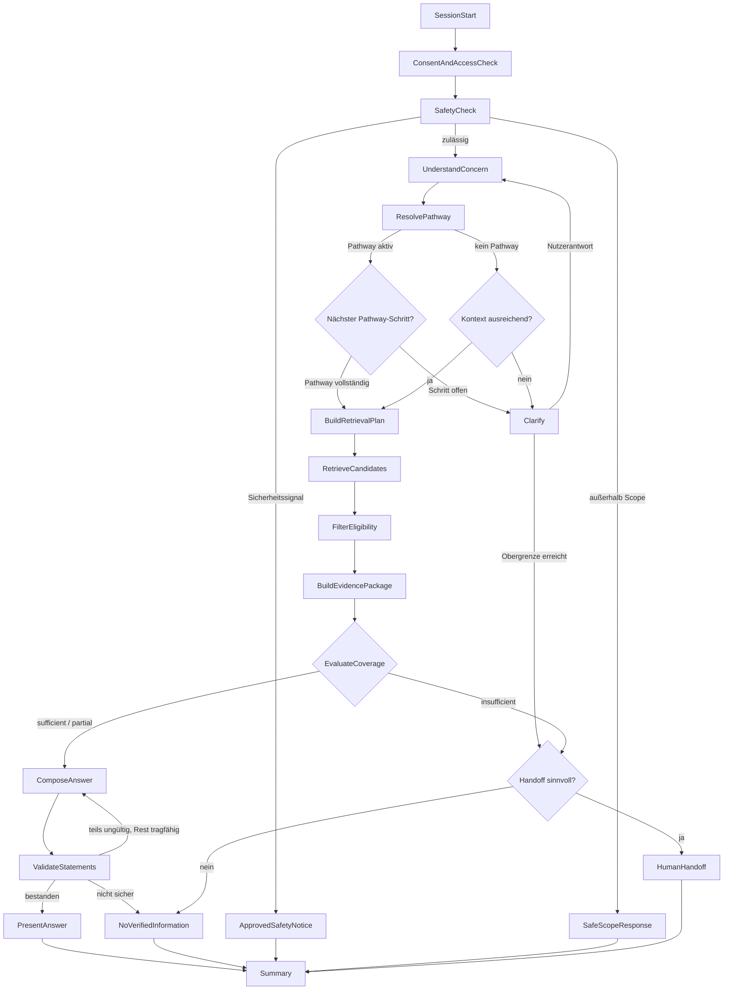

# CareApp – Architektur: Conversation-Orchestrierung (Layer 4)

**Status:** Accepted (Layer 4)
**Gültig für:** Chatbot-Teil mit agentischem Datenbankwissen
**Letzte Aktualisierung:** 2026-06-13 (ResolvePathway-Node ergänzt)
**Voraussetzungen:**
[Wissensmodell & Kontrollkern](architecture-knowledge-and-control-core.md) (Layer 1+2),
[LLM-Schichten & Threat-Model](architecture-llm-layers-and-threat-model.md) (Layer 3).
Alle dortigen Invarianten (D1–D8, T1–T13) gelten unverändert weiter.

---

## 0. Geltungsbereich

Dieses Dokument legt fest, **wie** die in Layer 1–3 spezifizierten Bausteine zur
Laufzeit verkettet werden:

- der **statische, versionierte Graph** (Nodes, erlaubte Kanten, Entscheidungen),
- die **Tool-Allowlist pro Node**,
- **Budgets** (Token / Schleifen / Zeit / Kosten) je Node und je Session,
- **Checkpointing** ohne unnötige personenbezogene Rohdaten,
- **Fail-Closed-Degradation** bei Komponentenausfall,
- die **Audit-/Trace-Referenzen** je Node.

Die Orchestrierung steuert den **Ablauf**, niemals die **fachliche Wahrheit**.
Vorgeschlagene Technologie: LangGraph. Der Graph ist statisch definiert,
nicht dynamisch vom LLM konstruiert.

---

## 1. Grundsätze der Orchestrierung

1. **Statischer, versionierter Graph.** Knoten und erlaubte Kanten sind fest
   definiert. Eine laufende Konversation läuft unter einem festgepinnten Tripel
   `(graph_version, prompt_set_version, model_version)`, das im Audit steht.
2. **Nutzereingabe ändert nie den Graphen.** Weder Graphstruktur noch
   Tool-Berechtigungen sind durch Eingaben beeinflussbar (T1). Eingaben sind
   ausschließlich Daten im State.
3. **Tool-Allowlist pro Node.** Jeder Node darf nur die ihm zugewiesenen,
   typisierten serverseitigen Tools aufrufen. Kein Node hat SQL-, DB-, Web- oder
   Freigabezugriff.
4. **Typisierte Ein-/Ausgaben.** Jeder Node liest/schreibt den typisierten
   `ConsultationState`. Hypothesen ⊥ bestätigte Fakten ⊥ Evidenz ⊥ Sitzungsmeta
   bleiben getrennt (D-Invarianten, T7).
5. **Begrenzte Schleifen.** Schleifen (insb. Clarify) haben harte Obergrenzen.
   Pro Node und pro Session gelten Token-/Zeit-/Kostenbudgets (T10, T13).
6. **Fail-Closed.** Jeder Fehler degradiert zur sicheren Teilantwort, zum
   verbindlichen Fallback oder zum Handoff — **nie** zu einer freien Modellantwort.
7. **Reproduzierbarkeit.** LLM-Nodes haben keine externen Seiteneffekte; ihr
   erzeugtes Artefakt wird mit Prompt-/Modellversion im Checkpoint festgehalten,
   sodass ein Audit-Replay das aufgezeichnete Artefakt nutzt, nicht einen neuen
   Modellaufruf.

---

## 2. Der statische Graph

Der `VALIDATE → COMPOSE`-Pfad ist **eng begrenzt** (max. 1 Recompose mit
*demselben* Evidence Package, um unabhängig entfernbaren ungültigen Inhalt zu
streichen) — nie freie Wiederholung (Layer 2 §4.5).

**Wichtig zum Pathway-Pfad:** `ResolvePathway` liest ausschließlich
`published` Pathways aus der DB. Der LLM-2-Output (`intent_hypotheses`) wird
deterministisch auf einen `LifeSituation.code` gemappt — das LLM bestimmt
nicht, welcher Pathway aktiv ist. `Clarify` fragt beim Pathway-Pfad nicht frei,
sondern liest den nächsten offenen `PathwayStep` und formuliert die
`question_template_de` des `DecisionNode` in natürlicher Sprache. Der Pfad
`DECIDE_FREE` bleibt als Fallback für Anfragen ohne passenden Pathway.

---

## 3. Node-Spezifikation

| Node | Typ | Tool-Allowlist | State: Ein → Aus | Fehlerkante (Fail-Closed) |
|---|---|---|---|---|
| **SessionStart** | det | — | init → `session_id`, Versions-Tripel | Abbruch mit neutralem Hinweis |
| **ConsentAndAccessCheck** | det | Auth-/Consent-Read | Auth-Kontext → `tenant_id`, `region` (aus **Auth**, nicht Nachricht – T4), `consent_state` | fehlende Einwilligung → SafeScopeResponse |
| **SafetyCheck** | LLM-1 + det | Klassifikation; `safety_notice`-Lookup | `latest_user_message` → `safety_classification`, Scope-Flag | Unsicher/Parsefehler → konservativ (SafeScopeResponse) |
| **UnderstandConcern** | LLM-2 | Interpretation | Nachricht + State → `intent_hypotheses`, `confirmed_facts`, `missing_information` | Parsefehler → Clarify oder NoVerifiedInformation |
| **ResolvePathway** | det | Pathway-Lookup (nur published) | `intent_hypotheses` → `active_pathway_id`, `current_step_id` (oder null) | kein Match → `DECIDE_FREE`-Pfad |
| **Clarify** | LLM-3 | Pathway-Step-Read; Rückfrage-Templates | Pathway-Pfad: nächster offener `PathwayStep` → formulierte Rückfrage. Freier Pfad: `missing_information` → Rückfrageblock | Obergrenze erreicht → HandoffQ |
| **BuildRetrievalPlan** | LLM-4 + det | Term-Vorschlag; **serverseitiger** Plan-Builder | Intent + Fakten → typisierter `RetrievalPlan` (Filter serverseitig) | Fehler → NoVerifiedInformation |
| **RetrieveCandidates** | det | Retrieval (nur **published** Index) | Plan → Kandidatenliste | Such-Ausfall → NoVerifiedInformation (+ ggf. Handoff) |
| **FilterEligibility** | det (Layer 2 §4.1) | — | Kandidaten + `RequestContext` → eligible CVs | unklar ⇒ Ausschluss; leer → COVER:insufficient |
| **BuildEvidencePackage** | det (Layer 2 §4.2) | — | eligible CVs → `EvidencePackage` (nur IDs + gefrorene Aussagen) | Relations-Konflikt → Downgrade |
| **EvaluateCoverage** | det (Layer 2 §4.3) | `aspect_map`-Read | Package → `sufficient`/`partial`/`insufficient` | unklar ⇒ insufficient |
| **ComposeAnswer** | LLM-5 | Composer | Package + bestätigte Fakten → Antwortblöcke | Parse-/Schemafehler → NoVerifiedInformation |
| **ValidateStatements** | det (Layer 2 §4.4) + optional LLM | Validator; opt. Bedeutungscheck | Blöcke → `ValidationResult` | jeder Zweifel ⇒ nicht-bestanden |
| **PresentAnswer** | det | Output-Block-Allowlist (T11/T12) | validierte Blöcke + Citations → UI | — |
| **NoVerifiedInformation** | det | — | → exakter Fallback-Wortlaut | — |
| **HumanHandoff** | det | Handoff-Prozess (eigene Autorisierung) | → kontrollierte Übergabe | Handoff nicht verfügbar → NoVerifiedInformation |
| **ApprovedSafetyNotice** | det | freigegebene `safety_notice` | → vorab freigegebener Hinweis | — |
| **SafeScopeResponse** | det | — | → neutraler Scope-Hinweis | — |
| **Summary** | det | Audit-Write | → Trace/Audit (siehe §6) | — |

`RequestContext` (für FilterEligibility) wird **serverseitig** aus Auth-Kontext +
bestätigten Fakten gebaut — nie aus rohen Nutzerbehauptungen (T4).

---

## 4. Budgets und Schleifen (Umsetzung T10 / T13)

| Grenze | Geltung | Zweck |
|---|---|---|
| `max_clarify_rounds` | pro Session | verhindert endloses Nachfragen → danach HandoffQ |
| `max_recompose` = 1 | pro Antwort | nur ein Recompose mit gleichem Package (Layer 2 §4.5) |
| `max_retrieval_passes` = 1 | pro Anfrage | kein iteratives „Nachsuchen“ bis etwas passt |
| Token-Budget | pro LLM-Node **und** pro Session | Kosten-/Missbrauchsschutz |
| Zeit-/Timeout-Budget | pro Node | hängende Aufrufe → Fail-Closed |
| Rate Limit | pro Identität/Session | Flooding-Schutz |
| Input-Größenlimit | pro Eingabe | Riesen-Input-/Injection-Schutz |

Überschreitung einer Grenze ist ein **Fehler-Ereignis** und führt über die
Fail-Closed-Kante des Nodes (Fallback oder Handoff), nie zu gelockerten Regeln.

---

## 5. Checkpointing

- Checkpoints speichern den **typisierten State**, nicht freie Chat-Historie.
- **Keine** unnötigen personenbezogenen Rohdaten: keine Klarnamen, Adressen,
  Versicherungsnummern oder vollständigen Freitextgespräche im Standard-Checkpoint.
- Pro LLM-Node wird das erzeugte Artefakt **plus** Prompt-/Modellversion
  festgehalten (Reproduzierbarkeit, §1.7).
- Aufbewahrung/Löschung der Checkpoints ist konfigurierbar (offene Entscheidung,
  §8).

---

## 6. Audit und Observability

Jeder Trace referenziert mindestens:

- Request- und Session-ID,
- `graph_version`, `prompt_set_version`, `model_version`,
- durchlaufene Nodes und Tool-Aufrufe,
- Retrieval-Konfiguration,
- `evidence_package_id` und verwendete `claim_version_id`s,
- `ValidationResult`,
- Fallback- bzw. Handoff-Grund,
- Laufzeit, Token, Kosten.

**Nicht** standardmäßig protokolliert: Namen, Adressen, Versicherungsnummern,
vollständige Freitextgespräche, private Dokumente. Fachliche Auditereignisse
(redaktionelle Freigaben) und technische Telemetrie bleiben getrennt.

---

## 7. Fail-Closed-Degradationsmatrix

Leitsatz: **Jeder Komponentenausfall degradiert Richtung sichere Antwort —
nie Richtung freie Antwort.** Dies erfüllt den Produktanspruch „degradierter
sicherer Betrieb“.

| Ausgefallene Komponente | Verhalten |
|---|---|
| Retrieval / Suche | RetrieveCandidates → NoVerifiedInformation (+ optional Handoff). Nie erfinden. |
| LLM (UnderstandConcern) | Bitte um Umformulierung oder Handoff. Keine Annahme des Anliegens. |
| LLM (Composer) | NoVerifiedInformation oder Handoff. Keine Antwort ohne Composer-Ausgabe. |
| **Validator** | **Fail-Closed:** ohne bestandene Validierung **nie** präsentieren → Fallback/Handoff. |
| Datenbank / Knowledge Store | Fail-Closed → Fallback/Handoff. |
| `safety_notice`-Lookup | konservativ: neutraler Hinweis + Handoff, keine modellgenerierte Sicherheitsaussage (T3). |

Ein Validator-Ausfall darf **niemals** zu „im Zweifel ausliefern“ führen.

---

## 8. Offene Entscheidungen (nicht durch KI zu treffen)

- Konkrete Budgetwerte (`max_clarify_rounds`, Token-/Zeit-/Kostengrenzen).
- Checkpoint-Aufbewahrung und Löschfristen (mit Datenschutz/Recht).
- Auslöser, Empfänger, Datenumfang und Autorisierung des HumanHandoff
  (eigener, serverseitig erzwungener Prozess).
- Schwelle, ab der `partial` statt `sufficient` zu Handoff statt Antwort führt.

---

## 9. Definition of Done (Layer 4)

**Milestone 4.1 (DECIDE_FREE-Spine) implementiert** — `src/careapp/orchestration/`,
End-to-End-Tests in `tests/db/test_orchestration.py`:

- [x] Statischer Graph mit Versions-Tripel `(graph, prompt_set, model)` im Audit.
- [x] Tool-Allowlist pro Node serverseitig erzwungen (`ToolContext` → `ToolNotAllowed`).
- [x] `RequestContext` serverseitig aus Auth-Kontext gebaut (nicht aus Nachricht, T4).
- [x] Schleifengrenzen aus §4 (`max_clarify_rounds`, `max_graph_steps`, single retrieval pass); Überschreitung → Fail-Closed. *(Token-/Kosten-Metering benötigt echten Adapter.)*
- [x] Audit-Trace §6: Session-ID, Versions-Tripel, Nodes, Tool-Aufrufe, `claim_version_id`s, ValidationResult, Fallback-Grund, LLM-Prompt-/Modellversionen. *(Laufzeit/Token/Kosten = echtes Metering offen.)*
- [x] Degradationsmatrix §7 als Tests (Consent-/Scope-/Parse-/Coverage-/Validator-Ausfall = Fail-Closed).
- [x] `VALIDATE → COMPOSE` ≤ 1 Recompose: aktuell konservativer **Voll-Fallback** statt Teil-Recompose (sicherer; Teil-Recompose-Kante reserviert für 4.2).

**Milestone 4.2 (Pathway-Pfad) implementiert** — `ResolvePathway`/`BuildRetrievalPlan`-Nodes,
mehrturniger E2E-Test in `tests/db/test_pathway.py`:

- [x] `ResolvePathway`: deterministisches Mapping `intent → LifeSituation.code → published Pathway`; Branch-Traversal über `PathwayBranch`. LLM bestimmt den Pathway nie.
- [x] `Clarify` liest beim Pathway-Pfad den nächsten offenen `PathwayStep` (`question_template_de`); kein freies Fragen (deterministisch, kein LLM-Aufruf).
- [x] `BuildRetrievalPlan` nutzt `PathwayStep.topic_hint` und terminalen `PathwayBranch.retrieval_scope_modifier` zur Coverage-Fokussierung.
- [x] Synthetischer Pathway-Durchlauf `heimunterbringung` als End-to-End-Test (inkl. Verzweigung).

**Offen → spätere Milestones:**
- [ ] Checkpoints ohne unnötige PII; LLM-Artefakte mit Version gespeichert. *(State ist typisiert & checkpoint-fähig — `pathway_answers`/`clarify_rounds_used` tragen über Turns; DB-Persistenz-Store fehlt.)*
- [ ] `BuildRetrievalPlan` als echter LLM-4-Node + Retrieval-Index *(derzeit deterministischer Fold „lade published CVs"; Filter serverseitig).*
- [ ] Token-/Kosten-Metering im Audit *(braucht echten Adapter statt FakeLLMClient).*

---

## 10. Nächste Schicht

- **Layer 5:** Evaluation (synthetisches Golden Test Set inkl. T1–T13 und der
  Degradationsfälle aus §7), Security-Tests, begrenzter Pilotbetrieb.

Empfohlene Modellnutzung: Metrik-/Testfall-Design mit **Sonnet 4.6, mittlerer
Aufwand**; nur die Definition der Sicherheits-Akzeptanzkriterien (was gilt als
bestanden) mit **Opus 4.8, mittel–hoch**.
